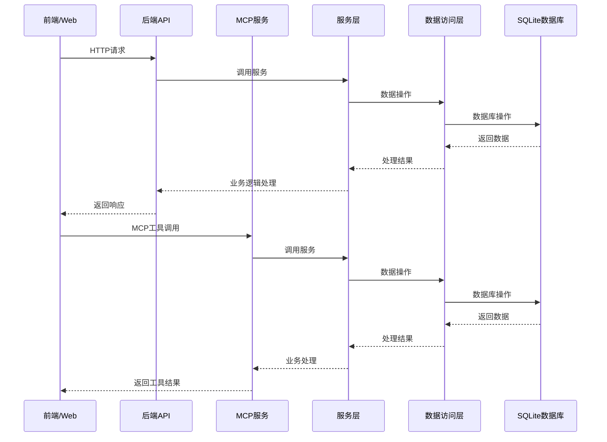
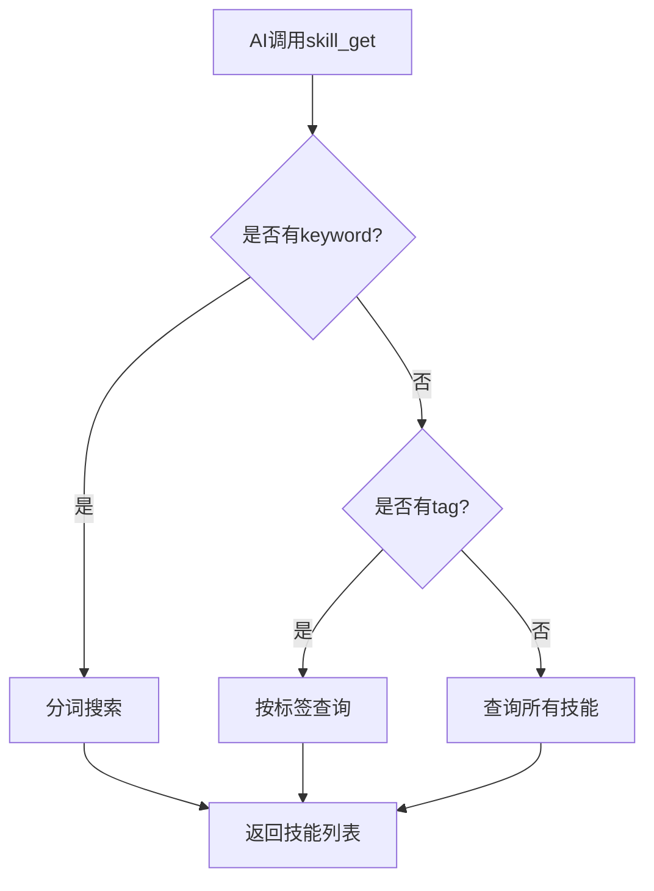
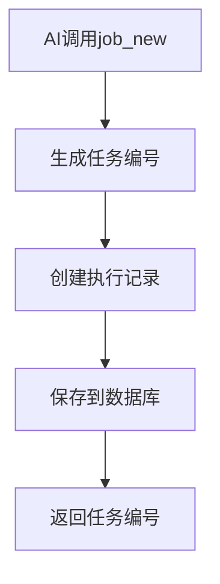
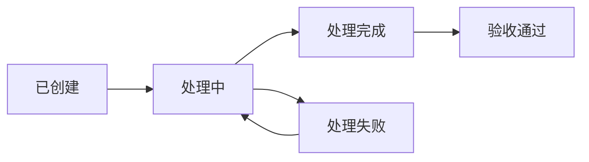

# 系统架构说明

## 1. 系统概述

智流MCP是一个提高AI工作流效率的MCP服务，通过管理技能、处理任务来提升AI工作流的效率。系统采用前后端分离架构，前端使用React + TypeScript + Ant Design + Vite，后端使用Go语言 + Chi路由器 + MCP协议。

## 2. 架构图



## 3. 前端架构

### 3.1 技术栈

- **框架**: React 19
- **语言**: TypeScript 5.9
- **UI组件库**: Ant Design 6.x
- **状态管理**: Zustand
- **构建工具**: Vite 5.x
- **包管理**: Yarn
- **路由**: React Router DOM 7.x

### 3.2 目录结构

```
frontend/
├── public/                 # 静态资源
├── src/
│   ├── components/         # 通用组件
│   ├── pages/              # 页面组件
│   │   ├── SkillManagement.tsx    # 技能管理页面
│   │   ├── JobTaskManagement.tsx  # 任务管理页面
│   │   └── TrashManagement.tsx    # 回收站页面
│   ├── services/           # API服务
│   ├── stores/             # 状态管理（Zustand）
│   ├── types/              # TypeScript类型定义
│   ├── App.tsx             # 应用主组件
│   └── main.tsx            # 应用入口
└── package.json
```

### 3.3 核心模块

#### 3.3.1 页面组件

- **SkillManagement**: 技能管理页面，支持CRUD操作、标签筛选、关键词搜索
- **JobTaskManagement**: 任务管理页面，支持任务跟踪、状态流转
- **TrashManagement**: 回收站页面，管理已删除的技能和任务

#### 3.3.2 服务层

前端服务层封装了与后端API的交互逻辑：

- **skillApi**: 技能相关API
- **tagApi**: 标签相关API
- **jobTaskApi**: 任务相关API
- **uploadApi**: 文件上传API

#### 3.3.3 状态管理

使用Zustand进行全局状态管理：

- 技能列表状态
- 任务列表状态
- 标签列表状态
- 用户界面状态

## 4. 后端架构

### 4.1 技术栈

- **语言**: Go 1.20+
- **Web框架**: Chi路由器
- **MCP协议**: mark3labs/mcp-go
- **ORM**: GORM
- **数据库**: SQLite
- **配置管理**: YAML配置文件
- **日志**: 自定义日志组件

### 4.2 目录结构

```
goend/
├── cmd/
│   ├── api/                # API服务入口
│   │   └── main.go
│   └── migrate/            # 数据库迁移工具
│       └── main.go
├── internal/
│   ├── api/                # API层
│   │   ├── handlers/       # HTTP请求处理器
│   │   │   ├── skill.go           # 技能API处理
│   │   │   ├── skill_tag.go       # 标签API处理
│   │   │   ├── jobtask.go         # 任务API处理
│   │   │   ├── upload.go          # 文件上传处理
│   │   │   └── static_file.go     # 静态文件处理
│   │   └── routers.go      # 路由注册
│   ├── cache/              # 本地缓存
│   ├── config/             # 配置管理
│   ├── mcp/                # MCP工具实现
│   │   ├── init.go         # MCP初始化
│   │   ├── skill.go        # skill_get工具
│   │   ├── skilldetail.go  # skill_detail工具
│   │   ├── save.go         # skill_save工具
│   │   ├── job_task.go     # 任务管理工具
│   │   └── consts.go       # MCP常量定义
│   ├── models/             # 数据模型
│   │   └── models.go       # Skill、Tag、JobTask等模型
│   ├── repositories/       # 数据访问层
│   │   ├── repository.go
│   │   ├── skill_repository.go
│   │   ├── skill_tag_repository.go
│   │   └── jobtask_repository.go
│   ├── services/           # 业务逻辑层
│   │   └── skill_service.go
│   └── utils/              # 工具函数
│       ├── files.go
│       ├── tray.go         # 系统托盘
│       └── logx/           # 日志组件
├── scripts/                # 构建脚本
│   └── builder.py
└── config.yml              # 配置文件
```

### 4.3 核心模块

#### 4.3.1 API层

API层负责处理HTTP请求和响应：

- **routers.go**: 路由注册和管理
- **skill.go**: 技能相关API（CRUD、回收站、导出）
- **skill_tag.go**: 标签相关API
- **jobtask.go**: 任务相关API
- **upload.go**: 文件上传处理

#### 4.3.2 MCP层

MCP层实现MCP协议工具：

- **skill_get**: 查询技能列表（支持标签筛选和关键词搜索）
- **skill_detail**: 查看技能详情
- **skill_save**: 保存/更新技能
- **job_new**: 创建新任务
- **job_get**: 查询任务详情
- **job_report**: 报告任务执行结果
- **job_redo**: 重新执行任务

#### 4.3.3 服务层

服务层实现业务逻辑：

- **skill_service.go**: 技能相关业务逻辑（分词索引、标签关联）

#### 4.3.4 数据访问层

数据访问层封装数据库操作：

- **skill_repository.go**: 技能数据操作
- **skill_tag_repository.go**: 标签数据操作
- **jobtask_repository.go**: 任务数据操作

#### 4.3.5 模型层

数据模型定义：

- **Skill**: 技能模型
- **Tag**: 标签模型
- **JobTask**: 任务模型
- **SkillTag**: 技能标签关联表
- **SkillToken**: 技能分词索引表

## 5. 数据流

### 5.1 技能查询流程



### 5.2 任务创建流程



### 5.3 任务状态流转



## 6. 核心功能

### 6.1 技能管理

- **技能存储**: 支持创建、查看、更新、删除技能
- **标签分类**: 为技能添加标签，便于分类管理
- **回收站**: 软删除机制，支持恢复误删技能
- **导入导出**: 支持技能导出为Markdown格式
- **关键词搜索**: 支持分词搜索技能

### 6.2 任务管理

- **任务跟踪**: 创建任务并跟踪执行过程
- **执行记录**: 每次执行都有独立记录，支持多次重试
- **项目分类**: 按项目组织任务
- **状态流转**: 已创建 → 处理中 → 处理完成/失败 → 验收通过
- **批量导出**: 支持CSV、JSON、Markdown格式导出

### 6.3 MCP工具

智流MCP提供以下MCP工具供AI调用：

| 工具名 | 功能 |
|--------|------|
| `skill_get` | 查询技能列表（支持标签筛选和关键词搜索） |
| `skill_detail` | 查看技能详情 |
| `skill_save` | 保存/更新技能 |
| `job_new` | 创建新任务 |
| `job_get` | 查询任务详情 |
| `job_report` | 报告任务执行结果 |
| `job_redo` | 重新执行任务（新思路） |

## 7. 系统扩展性

### 7.1 前端扩展

- **组件复用**: 模块化设计，便于组件复用
- **类型定义**: TypeScript类型系统，便于扩展和维护
- **服务层抽象**: API调用封装，便于替换底层实现

### 7.2 后端扩展

- **路由扩展**: Chi路由器支持动态路由注册
- **MCP工具扩展**: 模块化设计，便于添加新工具
- **服务层扩展**: 模块化设计，便于添加新功能
- **模型层扩展**: 支持添加新的数据模型和字段

## 8. 安全性考虑

- **输入验证**: 前端和后端都进行输入验证
- **错误处理**: 统一的错误处理机制
- **日志记录**: 详细的操作日志
- **文件上传安全**: 限制文件类型和大小
- **软删除**: 使用 `deleted_at` 字段实现软删除，避免数据丢失

## 9. 性能优化

- **前端优化**: 组件懒加载、虚拟列表
- **后端优化**: 数据库索引、分词索引加速搜索
- **API优化**: 合理的API设计，减少不必要的请求
- **缓存机制**: 本地缓存常用数据

## 10. 总结

智流MCP采用现代化的前后端分离架构，具有以下特点：

- **清晰的分层设计**: 前端和后端都采用分层架构，职责明确
- **现代化技术栈**: 使用React、TypeScript、Go等现代技术
- **MCP协议支持**: 支持MCP协议，可与各种AI工具集成
- **完整的功能实现**: 支持技能和任务的全生命周期管理
- **良好的用户体验**: 美观的界面和流畅的操作流程
- **可扩展的架构**: 便于添加新功能和扩展现有功能

系统架构设计合理，代码组织清晰，为后续的功能扩展和维护奠定了良好的基础。
